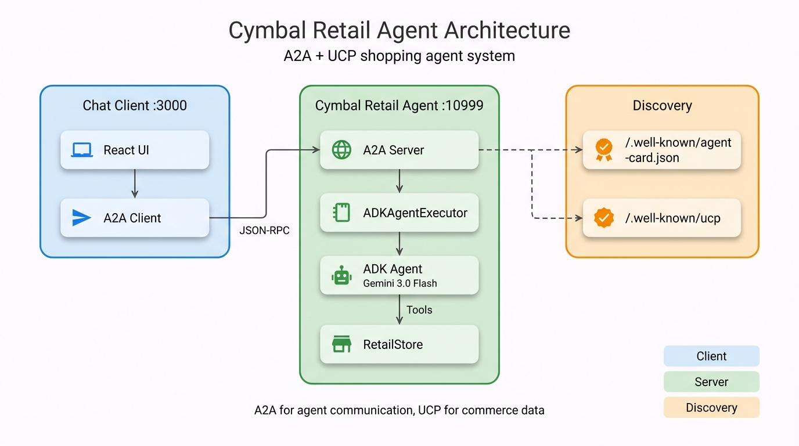

# Cymbal Retail Agent - Developer Guide

## TL;DR

- **ADK Agent** with 8 shopping tools (search, checkout, payment) using Gemini 3.0 Flash
- **UCP Integration** for standardized commerce data types and capability negotiation
- **A2A Protocol** for agent discovery and JSON-RPC messaging

## Architecture

<div align="center">
  
  <p><em>System architecture — Chat Client (React + A2A Client) communicates via JSON-RPC to the Cymbal Retail Agent (A2A Server → ADKAgentExecutor → ADK Agent → RetailStore). Discovery endpoints expose agent capabilities and UCP profile.</em></p>
</div>

## Quick Reference

### Key Files

| File | Purpose |
|------|---------|
| `business_agent/src/business_agent/agent.py` | ADK agent + 8 tools |
| `business_agent/src/business_agent/store.py` | Checkout state machine |
| `business_agent/src/business_agent/agent_executor.py` | A2A ↔ ADK bridge |
| `chat-client/App.tsx` | React app + A2A messaging |

### Endpoints

| Endpoint | Purpose |
|----------|---------|
| `GET /.well-known/agent-card.json` | A2A agent discovery |
| `GET /.well-known/ucp` | UCP merchant profile |
| `POST /` | A2A JSON-RPC endpoint |

### State Keys

| Key | Purpose |
|-----|---------|
| `user:checkout_id` | Current checkout session |
| `__ucp_metadata__` | Negotiated capabilities |
| `__payment_data__` | Payment instrument |

## Deep Dive Guides

| Guide | Topics |
|-------|--------|
| [Architecture](docs/01-architecture.md) | System components, data flow |
| [ADK Agent](docs/02-adk-agent.md) | Tools, callbacks, session management |
| [UCP Integration](docs/03-ucp-integration.md) | Capabilities, profiles, negotiation |
| [Commerce Flows](docs/04-commerce-flows.md) | Checkout lifecycle, payment |
| [Frontend](docs/05-frontend.md) | React components, A2A client |
| [Extending](docs/06-extending.md) | Add tools, products, capabilities |
| [Testing Guide](docs/07-testing-guide.md) | Testing, debugging, troubleshooting |

## Quick Start

```bash
# Backend
cd a2a/business_agent && uv sync && cp env.example .env
# Add GOOGLE_API_KEY to .env
uv run business_agent

# Frontend (new terminal)
cd a2a/chat-client && npm install && npm run dev

# Open http://localhost:3000
```

See [README.md](README.md) for detailed setup instructions.
