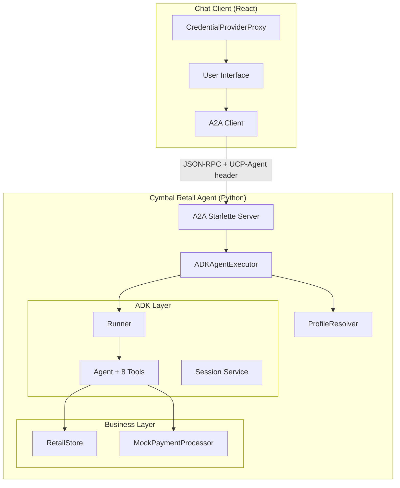
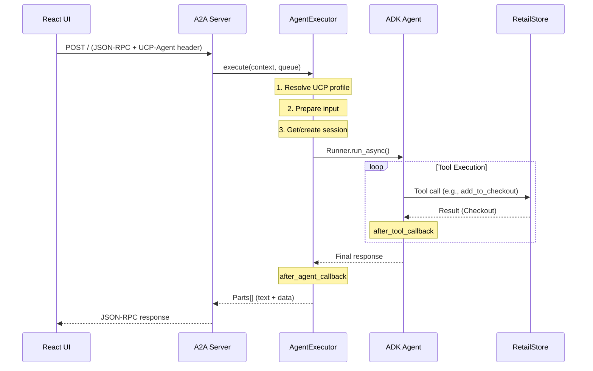

# System Architecture

## TL;DR

- **4 layers**: A2A Server → Agent Executor → ADK Agent → Retail Store
- **2 protocols**: A2A (agent communication) + UCP (commerce data)
- **Request flow**: JSON-RPC → ADK Runner → Tool execution → Response

## System Overview



## Components

### Backend

| Component | File | Responsibility |
|-----------|------|----------------|
| A2A Server | `main.py` | HTTP server, routing, static files |
| Agent Executor | `agent_executor.py` | Bridge A2A ↔ ADK, session management |
| Profile Resolver | `ucp_profile_resolver.py` | UCP capability negotiation |
| ADK Agent | `agent.py` | LLM reasoning, tool execution |
| Retail Store | `store.py` | Products, checkouts, orders |
| Payment Processor | `payment_processor.py` | Mock payment handling |

### Frontend

| Component | File | Responsibility |
|-----------|------|----------------|
| App | `App.tsx` | State management, A2A messaging |
| ChatMessage | `components/ChatMessage.tsx` | Message rendering |
| Checkout | `components/Checkout.tsx` | Checkout display |
| ProductCard | `components/ProductCard.tsx` | Product cards |
| PaymentMethodSelector | `components/PaymentMethodSelector.tsx` | Payment selection |

## Request Flow



## Layer Responsibilities

| Layer | Input | Output | Key Class |
|-------|-------|--------|-----------|
| **A2A Server** | HTTP request | HTTP response | `A2AStarletteApplication` |
| **Agent Executor** | A2A context | Event queue | `ADKAgentExecutor` |
| **ADK Agent** | User query + state | Tool results | `Agent` (google.adk) |
| **Retail Store** | Method calls | Domain objects | `RetailStore` |

## Data Storage

All data is **in-memory** (mock implementation):

```python
class RetailStore:
    _products: dict[str, Product]    # Loaded from products.json
    _checkouts: dict[str, Checkout]  # Session-based
    _orders: dict[str, Checkout]     # Completed orders
```

## Discovery Endpoints

| Endpoint | Purpose | Source |
|----------|---------|--------|
| `/.well-known/agent-card.json` | A2A agent capabilities | `data/agent_card.json` |
| `/.well-known/ucp` | UCP merchant profile | `data/ucp.json` |
| `/images/*` | Product images | `data/images/` |
