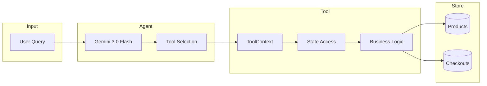

# ADK Agent Patterns

## TL;DR

- **Agent**: Gemini 3.0 Flash with 8 shopping tools
- **Tools**: Access `ToolContext` for state, return dict with UCP keys
- **Callbacks**: `after_tool_callback` captures results, `after_agent_callback` formats output

## Agent Configuration

```python
# agent.py:437
root_agent = Agent(
    name="shopper_agent",
    model="gemini-3-flash-preview",
    description="Agent to help with shopping",
    instruction="You are a helpful agent who can help user with shopping...",
    tools=[
        search_shopping_catalog,
        add_to_checkout,
        remove_from_checkout,
        update_checkout,
        get_checkout,
        start_payment,
        update_customer_details,
        complete_checkout,
    ],
    after_tool_callback=after_tool_modifier,
    after_agent_callback=modify_output_after_agent,
)
```

## Tool Pattern

Every tool follows this pattern:

```python
def tool_function(tool_context: ToolContext, param: str) -> dict:
    """Docstring visible to LLM for reasoning."""

    # 1. Get state
    checkout_id = tool_context.state.get(ADK_USER_CHECKOUT_ID)
    metadata = tool_context.state.get(ADK_UCP_METADATA_STATE)

    # 2. Validate
    if not metadata:
        return _create_error_response("Missing UCP metadata")

    # 3. Execute business logic
    try:
        result = store.method(...)
    except ValueError as e:
        return _create_error_response(str(e))

    # 4. Update state if needed
    tool_context.state[ADK_USER_CHECKOUT_ID] = result.id

    # 5. Return UCP-formatted response
    return {UCP_CHECKOUT_KEY: result.model_dump(mode="json")}
```

## All 8 Tools

| Tool | Line | Purpose | State Access |
|------|------|---------|--------------|
| `search_shopping_catalog` | 51 | Search products | Read metadata |
| `add_to_checkout` | 73 | Add item to cart | Read/write checkout_id |
| `remove_from_checkout` | 115 | Remove item | Read checkout_id |
| `update_checkout` | 151 | Update quantity | Read checkout_id |
| `get_checkout` | 187 | Get current state | Read checkout_id |
| `update_customer_details` | 212 | Set buyer/address | Read checkout_id |
| `start_payment` | 340 | Begin payment flow | Read checkout_id |
| `complete_checkout` | 270 | Finalize order | Read checkout_id, payment |

## Tool Execution Flow



## Callbacks

### after_tool_callback

Captures UCP data from tool results for later use:

```python
# agent.py:379
def after_tool_modifier(
    tool: BaseTool,
    args: dict[str, Any],
    tool_context: ToolContext,
    tool_response: dict,
) -> dict | None:
    """Stores UCP responses in state for output transformation."""
    extensions = tool_context.state.get(ADK_EXTENSIONS_STATE_KEY, [])
    ucp_response_keys = [UCP_CHECKOUT_KEY, "a2a.product_results"]

    # Only capture if UCP extension is active
    if UcpExtension.URI in extensions and any(
        key in tool_response for key in ucp_response_keys
    ):
        tool_context.state[ADK_LATEST_TOOL_RESULT] = tool_response

    return None  # Don't modify the response
```

### after_agent_callback

Transforms agent output to include structured data:

```python
# agent.py:408
from google.genai import types

def modify_output_after_agent(
    callback_context: CallbackContext,
) -> types.Content | None:
    """Adds UCP data parts to agent's response."""
    latest_result = callback_context.state.get(ADK_LATEST_TOOL_RESULT)
    if latest_result:
        # Create function response with UCP data
        return types.Content(
            parts=[
                types.Part(
                    function_response=types.FunctionResponse(
                        response={"result": latest_result}
                    )
                )
            ],
            role="model",
        )
    return None
```

## Session & State Management

### State Keys

```python
# constants.py
ADK_USER_CHECKOUT_ID = "user:checkout_id"      # Checkout session ID
ADK_PAYMENT_STATE = "__payment_data__"          # Payment instrument
ADK_UCP_METADATA_STATE = "__ucp_metadata__"     # Capabilities
ADK_EXTENSIONS_STATE_KEY = "__session_extensions__"
ADK_LATEST_TOOL_RESULT = "temp:LATEST_TOOL_RESULT"
```

### State Flow

1. **Request arrives** → Executor builds initial state delta
2. **Tools execute** → Read/write state via `tool_context.state`
3. **Callbacks fire** → Capture results in state
4. **Response sent** → State persisted in session

## ADK → A2A Bridge

`ADKAgentExecutor` bridges the protocols:

```python
# agent_executor.py
class ADKAgentExecutor:
    async def execute(self, context, event_queue):
        # 1. Activate extensions
        self._activate_extensions(context)

        # 2. Prepare UCP metadata
        ucp_metadata = UcpRequestProcessor.prepare_ucp_metadata(context)

        # 3. Extract input
        query, payment_data = self._prepare_input(context)

        # 4. Build message content
        content = types.Content(
            role="user", parts=[types.Part.from_text(text=query)]
        )

        # 5. Build state delta
        state_delta = self._build_initial_state_delta(
            context, ucp_metadata, payment_data
        )

        # 6. Run agent (async iterator)
        async for event in self.runner.run_async(
            user_id=user_id,
            session_id=session_id,
            new_message=content,
            state_delta=state_delta,
        ):
            if event.is_final_response():
                # Process final response parts
                result_parts = self._process_event(event)

        # 7. Enqueue response
        event_queue.enqueue(result_parts)
```

## Adding a New Tool

1. **Define function** with `ToolContext` parameter:

```python
def my_new_tool(tool_context: ToolContext, param: str) -> dict:
    """Description for LLM reasoning."""
    # Implementation
    return {UCP_CHECKOUT_KEY: result.model_dump(mode="json")}
```

2. **Add to agent**:

```python
root_agent = Agent(
    ...
    tools=[...existing..., my_new_tool],
)
```

3. **Update instruction** if needed to guide LLM usage.
